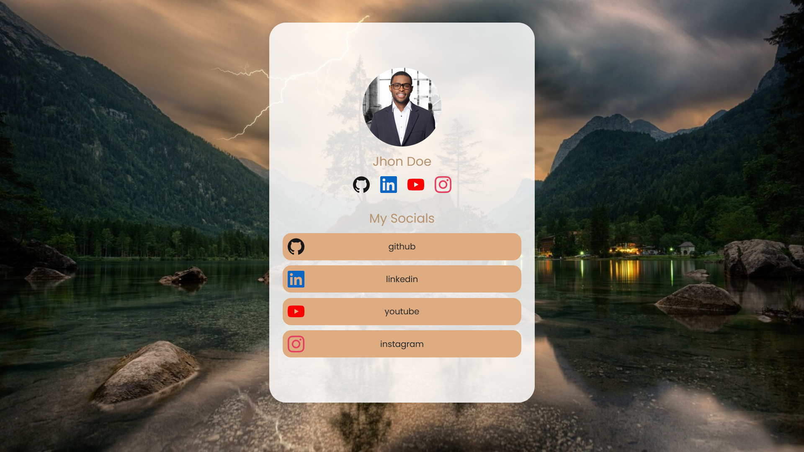

<p align="center">
  <a href="https://pypi.org/project/mail-Generator/" target="_blank">
    
  </a>
</p>


[](https://matthieuev.github.io/linktobio-maker/)


# LinkToBio Maker

The easiest way to create a link-to-bio page for your social media!

## Example



## Installation

There are two ways to use this tool:

### Using the build version

To use the build version, you can download the file `dist.zip` or `dist.tar.gz` from the latest release [here](https://github.com/matthieuEv/linktobio-maker/releases) and extract it.

Inside the extracted folder, you will find the `index.html` file and all the necessary files to run the website. In this location, you will create your [`template.json`](#create-your-templatejson) file. To see the website, you must use a local server. You can use the following command to start a local server:

```py
python -m http.server 8000
```

Then, you can open your browser and go to [`http://localhost:8000`](http://localhost:8000) to see the website.

When you finish creating your link to bio page, you can can use all the files in the `dist` to host the website on your own server.

### Using Docker

You can also use the Docker image to run the website. To do so, you can use the following command:

```bash
docker run -d -p 80:80 -v <the location of your template.json file>:/usr/share/nginx/html/template.json:ro --name linktobio-maker-container ghcr.io/matthieuev/linktobio-maker/linktobio-maker:latest
```

This command will start a container with the website running on port 80. You can access the website by going to [`http://localhost`](http://localhost). The `template.json` file must be in the location you specified in the command.

## Create your template.json

To create your `template.json` file, you can use the following example:

**Example:**
```json
{
    "name": "Jhon Dzaazazdoe",
    "profilPicture": "https://media.licdn.com/dms/image/C4D03AQGFbw2qhnvWzA/profile-displayphoto-shrink_400_400/0/1627680668150?e=1720656000&v=beta&t=ZRxZR-Bwp_aVkx8b1BrjYsVM7KH3kiSuwVSZ_kHn3c8",
    "quickLinks":{
        "github": "https://github.com/",
        "youtube":"https://www.youtube.com/",
    }
}
```
**Full Example:**
```json
{
    "name": "Jhon Dzaazazdoe",
    "profilPicture": "https://media.licdn.com/dms/image/C4D03AQGFbw2qhnvWzA/profile-displayphoto-shrink_400_400/0/1627680668150?e=1720656000&v=beta&t=ZRxZR-Bwp_aVkx8b1BrjYsVM7KH3kiSuwVSZ_kHn3c8",
    "quickLinks":{
        "github": "https://github.com/",
        "youtube":"https://www.youtube.com/",
    },
    "content":{
        "My Socials":{
            "github": "https://github.com/matthieuEv",
            "linkedin": "https://www.linkedin.com/",
            "linkedin":"https://www.linkedin.com/"
        }
    },
    "settings":{
        "logo":"https://upload.wikimedia.org/wikipedia/commons/thumb/2/24/LEGO_logo.svg/768px-LEGO_logo.svg.png",
        "background":"https://4kwallpapers.com/images/wallpapers/3d-background-texture-geometric-shapes-pattern-illustration-3840x2160-4549.jpg",
        "primaryColor":"#F00",
        "secondaryColor":"#FF0",
        "tertiaryColor":"#00F"
    }
}
```

| Option | Description | Needed |
| --- | --- | --- |
| name | Your name | ✅ |
| profilPicture | The URL of your profile picture | ✅ |
| quickLinks | A small list of links you want to be accessible <br> The icons used are from https://simpleicons.org/, the **key** must be the title of your icon like in the example. | ✅ |
| content | The content of your page <br> The **key** is the title of the section <br> The **value** is a list of links <br> The **key** of the **link** is the title of the link <br> The **value** is the URL of the link | ❌ |
| settings | The settings of your page <br> **logo**: The URL of the logo of your page <br> **background**: The URL of the background image of your page <br> **primaryColor**: The primary color of your page <br> **secondaryColor**: The secondary color of your page <br> **tertiaryColor**: The tertiary color of your page | ❌ |

> [!NOTE]  
> In the template.json file, every URL can also be a local path to your image but you must add it to the volume you specified when you started the Docker container.

## License

Distributed under the GPL-3.0 license. See [`LICENSE`](https://github.com/matthieuEv/linktobio-maker/blob/main/LICENSE) for more information.
